# 3 - Installation
## Question 3A
Le package MariaDb est deja installé et contient les dependances de Mysql

 ## Question 3A
 Mariadb est la version opensource et gratuite de Mysql, c'est un fork de Mysql avant son rachat par Sun microsystems.
# Prise en main

 ## Question 4A
 le fichier de configuration principal se situe dans

    /etc/my.cnf

## Question 4B
l'extension du fichier est un .cnf

## Question 4C

## Question 4D
le dossier contenant les bases de données est situé dans 

    /var/lib/mysql/

## Question 4E
Ce n'est pas pertinent car il est stocké dans le systeme ce qui peut causer une perte de données en cas de problemes avec le systeme
il faut toujours separés nos données du systeme

## Question 4F
Pour un serveur de production on pourrait stocker nos bases de données à partir d'un serveur RAID par exemple. Ce systéme nous permet d'avoir accés à des sauvegardes et protege egalement contre la perte des données

# Démarrez le service mariadb

## Question 5A
le service mariadb ecoute sur le port 3306 par defaut. On peut l'afficher à l'aide de la commande 

    netstat -tlnp

## Question 5B
sur l'ensembles des IPV4 de la machine locale

# Connexion au service

## Question 6A
on peut se connecter à notre base de données avec la commande 

    mysql -uroot

## Question 6B
l'option --protocol nous permet de nous connecter au serveur avec un protocol different de celui qui est configuré par defaut 

## Question 6C
on peut utiliser un outils qui permet d'avoir une interface graphique comme Dbeaver mais ils faudrait changer les permissions. On peut egalement utiliser un tunnel ssh, option qui est plus securisé
## Question 6D
par defaut c'est le protocole Socket qui est utilisé par le client car on ne precise pas de host.

## Sécurisation
## Question 7A 
le compte administrateur utilisé par mariadb est root.

## Question 7B
On nous indique que cette connection n'est pas autorisé à ce connecter à la base de données 

## Question 7C
Si on utilise notre adresse ip locale, on peut se connecter à la base de données. on est bien en TCP car on precise le -h 
pour nous connecter on utilise la commande 

    mysql -h 127.0.0.1 -u root

## Question 7D
en remplacant l'ip locale par localhost on obtient le meme resultat

## Question 7E
la securité des données repose uniquement sur le mot de passe du compte utilisateur root de la machine. si un utilisateur à accés au compte root et donc à la machine, il aura egalement accés à la base de données 

## Création d’une DB via un script SQL
## Question 8A 
on rentre dans la base de données et on effectue la commande SQl suivante

    CREATE DATABASE worlddb;

# Question 8B
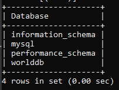

## Question 8C
dans le fichier de configuration on rajoute la ligne 

    max_allowed_packet=500M
pour pouvoir injecter le script sans problemes de taille max

ensuit telecharge le script avec wget et on fait 

    mysql -u root -p worlddb < WORLDDB-FINAL-UTF8.sql

## Question 8D
il y a trois tables dans la BDD

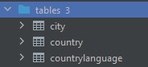

on peut le voir graphiquement avec un outil comme datagrip ou en local avec la commande SQL

    SHOW TABLES;

## Question 8E
on peut compter le nombre de pays à l'aide de 

    Select count(*) from country;

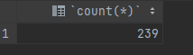

## Question 8F
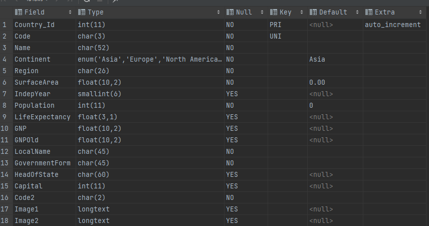
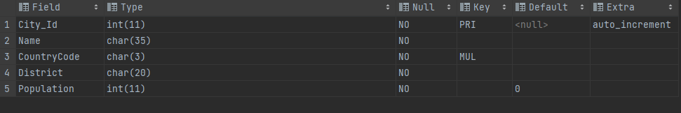
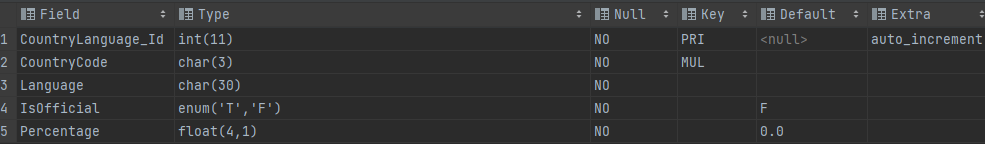

## Question 8G
On dezip le fichier contenant les scripts puis on les injecte avec la commande 

    mysql -u root -p worlddb < script1.sql
    mysql -u root -p worlddb < script2.sql

## Question 8H

    select * from actor
    where actor_id < 6;
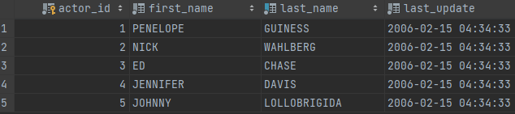

## Question 8I
On utilise la commande 

    SHOW databases;
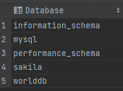

## Question 8J

    drop database sakila;

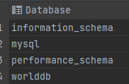

# Gestion des comptes et accès
## Question 9A
Si l'application web presente des failles de securité, une personne mal intentionné et non autorisé pourrait se connecter à la base de données et modifier/supprimer des informations.

## Question 9B
c'est un groupe de methodes d'exploitation de faille de securité qui permet d'injecter une requete sql au sein d'un morceau de code non prevu à cet effet. Cela à pour consequence principale de compromettre la securité du systéme et de la base de données 

## Question 9C
    CREATE USER 'worldbuser'@'localhost' IDENTIFIED BY 'worldbuser ';

## Question 9D
    grant ALL PRIVILEGES ON worlddb . * TO 'worldbuser'@'localhost';

## Question 9E
    show grants for worldbuser@localhost;

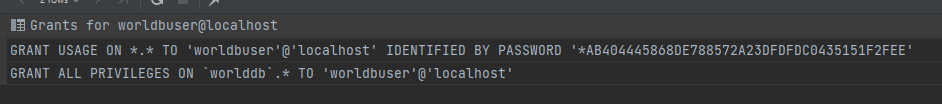

## Question 9F
FLUSH PRIVILEGES permet de rafraichir à chaud les informations concernant les privileges dans la database

## Question 9G
On se connecte avec le compte et on essaye de modifier des informations dans la table worlddb

## Question 9H
On se connecte avec notre utilisateur et on effectue la commande 

    show databases;

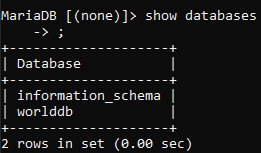

## Question 9I
La commande REVOKE sert à supprimer des droits 

## Question 9J
permet de modifier les permissions pour un utilisateur.

## Question 9K
verifie les privileges d'acces pour un Host, un username et une liste de base de données 

# Sauvegarde et restauration
## Question 10A
Avec des failles de securités le principaux dangers sont la recuperation/modification de données ainsi que la destruction de certaines données sans possibilités de recuperation.

## Question 10B
    update country set Population = 10;

## Question 10C
    mysql -u root -p worlddb < worlddb.sql

## Question 10E
une sauvegarde logique permet de fragmenter la sauvegarde en plusieurs parties, elle peut etre restaurer avec les instructions sql de base tel que CREATE DATABASE

## Question 10G
on peut utiliser differentes commandes pour effectuer une sauvegarde 
- mysqlhotcopy
- mysqldump
- 